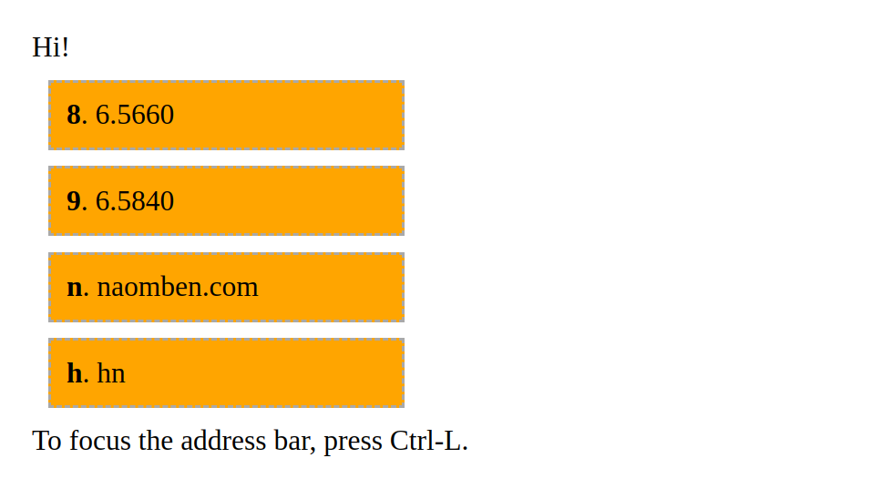

## Startpage

Just a simple page that can be used as the front page of my browser. Gives keyboard shortcuts for common websites that I use while avoiding the nondeterminism of relying on the browser's autocomplete.

I have this set as the new tab page for my browser, so I simply open a new tab, press escape to defocus the address bar, then press the key for the page that I want to visit.

